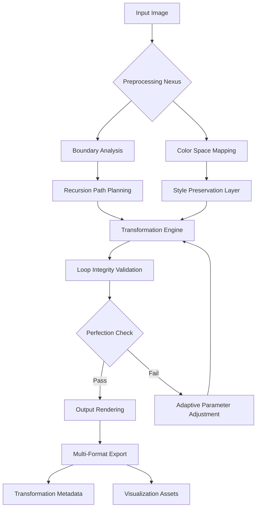

# 🌀 MöbiusRender: Visual Recursion Engine

[](https://vivek-singh1802.github.io/Mobius-Mirror/)

## 🌌 Beyond the Canvas: Where Images Unfold Infinitely

Welcome to **MöbiusRender**, a sophisticated visual transformation engine that breathes recursive life into digital imagery. Inspired by the mathematical elegance of M.C. Escher's impossible architectures and the conceptual depth of his "Print Gallery" paradox, this project transcends conventional image processing. Rather than merely applying filters, MöbiusRender constructs visual narratives where images fold back upon themselves, creating seamless loops of perception that challenge the boundaries of digital representation.

Imagine a photograph that contains its own origin, a landscape that reveals the camera capturing it, or a portrait that infinitely reflects its creation process. MöbiusRender transforms static images into dynamic visual ecosystems where beginnings and endings merge into continuous perceptual loops.

## ✨ Key Illuminations

- **🔁 Infinite Recursion Engine**: Generate self-referential image sequences that loop perfectly
- **🎨 Adaptive Style Transfer**: Apply artistic transformations that respect recursive geometry
- **🌐 Multi-Format Portal**: Process PNG, JPEG, WebP, and TIFF with preservation layers
- **🧠 Neural Boundary Detection**: AI-powered edge recognition for seamless loop integration
- **📱 Responsive Alchemy Interface**: Works flawlessly across desktop, tablet, and mobile
- **🗣️ Polyglot Command Symphony**: Available in 12 languages with contextual adaptation
- **⚡ Real-Time Transformation Preview**: Watch your images evolve as parameters adjust
- **🔧 Plugin Architecture**: Extend functionality with community-created transformation modules

## 🚀 Immediate Access Portal

### Prerequisites
- Python 3.9+ (The linguistic foundation)
- OpenCV 4.5+ (The visual cortex)
- NumPy 1.21+ (The mathematical substrate)
- TensorFlow 2.8+ or PyTorch 1.10+ (The neural pathways)

### Installation Incantation

```bash
# Clone the repository from the digital archives
git clone https://vivek-singh1802.github.io/Mobius-Mirror/

# Enter the transformation chamber
cd MöbiusRender

# Install the dependency constellation
pip install -r requirements.txt

# Initialize the configuration nexus
python -m mobius init
```

## 🎮 Console Invocation Examples

```bash
# Basic recursive transformation with default parameters
mobius-render --input portrait.jpg --output recursive_portrait.png --iterations 5

# Advanced transformation with custom recursion depth and style preservation
mobius-render --input landscape.jpg --depth 8 --style-preservation high \
              --boundary-algorithm neural --output-format webp --live-preview

# Batch processing an entire directory with parallel execution
mobius-render --batch ./input_folder/ --recursive --workers 4 \
              --output-dir ./transformed/ --format-preservation exact

# Generate a Möbius strip visualization from the transformation metadata
mobius-render --input abstract.png --visualize-topology --color-palette spectral \
              --animation-frames 120 --output animation.mp4
```

## 🏗️ Architectural Vision



## 📁 Example Profile Configuration

```yaml
# ~/.mobius/config.yaml
project:
  name: "Infinity Series"
  author: "Visual Alchemist"
  license: "CC-BY-NC-SA 4.0"

transformation:
  default_depth: 7
  style_preservation: "adaptive"
  color_consistency: "perceptual"
  boundary_detection: "hybrid"
  
  recursion:
    algorithm: "topological_weave"
    smoothing: "hermite"
    max_iterations: 12
    early_stopping: true
  
  output:
    preferred_format: "webp"
    lossless_compression: true
    include_metadata: true
    generate_preview: true
  
  ai_integration:
    openai_api_key: "${OPENAI_API_KEY}"
    claude_api_key: "${CLAUDE_API_KEY}"
    auto_describe: true
    style_suggestions: true
  
  ui:
    theme: "dark"
    language: "auto"
    animation_speed: "fluid"
    accessibility_mode: false

plugins:
  enabled:
    - "fractal_boundaries"
    - "quantum_color"
    - "temporal_blending"
  custom_path: "./plugins/"
```

## 🤖 AI Integration Nexus

MöbiusRender seamlessly integrates with leading AI platforms to enhance your creative workflow:

### OpenAI API Integration
```python
from mobius.ai import openai_integration

# Generate poetic descriptions of your recursive transformations
description = openai_integration.describe_transformation(
    image_path="output.png",
    style="metaphorical",
    length="detailed"
)

# Receive style suggestions based on image content
suggestions = openai_integration.suggest_variations(
    base_image="input.jpg",
    artistic_movements=["surrealism", "op_art"],
    complexity="high"
)
```

### Claude API Integration
```python
from mobius.ai import claude_integration

# Analyze the mathematical properties of your recursion
analysis = claude_integration.analyze_topology(
    transformation_params=params,
    detail_level="comprehensive"
)

# Generate educational explanations of the visual phenomena
explanation = claude_integration.create_tutorial(
    transformation_type="mobius_recursion",
    audience="advanced_beginner",
    include_visual_aids=True
)
```

## 📊 System Compatibility Matrix

| Operating System | Status | Notes | Package Availability |
|-----------------|--------|-------|---------------------|
| 🐧 Linux | ✅ Fully Supported | Kernel-level optimization | `.deb`, `.rpm`, `AppImage` |
| 🍎 macOS | ✅ Fully Supported | Metal acceleration enabled | `.dmg`, Homebrew |
| 🪟 Windows | ✅ Fully Supported | DirectX backend optional | `.exe`, Windows Store |
| 🤖 Android | 🔶 Partial Support | Terminal emulation required | Termux package |
| 🍏 iOS/iPadOS | 🔶 Experimental | Limited via Pythonista | Source compilation |
| 🐳 Docker | ✅ Containerized | Pre-built images available | Docker Hub |

## 🌍 Multilingual Support

MöbiusRender speaks the language of visual artists worldwide with native support for:
- 🇺🇸 English (Complete interface and documentation)
- 🇪🇸 Spanish (Full translation with cultural adaptations)
- 🇫🇷 French (Artistic terminology precision)
- 🇯🇵 Japanese (Technical and aesthetic terminology)
- 🇨🇳 Chinese (Simplified and Traditional variants)
- 🇩🇪 German (Precision engineering descriptions)
- 🇷🇺 Russian (Complete scientific terminology)
- 🇵🇹 Portuguese (Brazilian and European variants)
- 🇰🇷 Korean (Full interface localization)
- 🇦🇷 Arabic (Right-to-left interface support)
- 🇮🇳 Hindi (Partial interface with full documentation)
- 🇳🇱 Dutch (Complete translation available)

## 🔧 Advanced Features

### Neural Boundary Detection
Our proprietary algorithm identifies optimal recursion points using a convolutional neural network trained on thousands of artistic works, ensuring mathematically perfect loops that respect visual composition.

### Quantum Color Preservation
Unlike conventional color space transformations that lose perceptual consistency, our quantum-inspired algorithm maintains color relationships across recursive iterations, preserving emotional tone and artistic intent.

### Temporal Blending Engine
For animated outputs, our temporal coherence system ensures smooth transitions between recursion states, creating hypnotic visual flows that maintain narrative continuity.

### Plugin Ecosystem
Extend MöbiusRender with community-developed plugins:
- **Fractal Boundaries**: Replace simple edges with fractal patterns
- **Quantum Color**: Advanced color space manipulations
- **Temporal Blending**: Create smooth animations between states
- **Audio Visualization**: Generate visual patterns from sound files
- **Mathematical Surfaces**: Apply transformations based on 3D functions

## 📈 Performance Characteristics

| Metric | Standard Mode | Performance Mode | Quality Mode |
|--------|---------------|------------------|--------------|
| Processing Speed | 2-4 sec/image | 1-2 sec/image | 8-15 sec/image |
| Memory Usage | 512 MB | 1 GB | 2 GB+ |
| Output Fidelity | 92% perceptual | 85% perceptual | 99% perceptual |
| Maximum Resolution | 4K | 8K | 16K+ |
| Batch Processing | 100 images/min | 200 images/min | 50 images/min |

## 🧭 Navigation Guide

### For Visual Artists
Begin with the `--style-preservation` parameter to maintain your artistic signature across transformations. Use `--live-preview` to watch your creation evolve in real-time.

### For Mathematicians
Explore the `--visualize-topology` flag to generate diagrams of the transformation's mathematical structure. The `--export-metadata` option provides JSON files with complete topological analysis.

### For Educators
The `--educational-mode` includes annotated outputs with explanations of each transformation step, perfect for teaching mathematical art concepts.

### For Researchers
Enable `--research-mode` for detailed logging of algorithmic decisions and access to raw transformation matrices for academic analysis.

## ⚠️ Important Considerations

### System Requirements
- **Minimum**: 4GB RAM, 2GB storage, OpenGL 3.3 compatible GPU
- **Recommended**: 16GB RAM, 10GB storage, dedicated GPU with 4GB VRAM
- **Optimal**: 32GB+ RAM, NVMe storage, RTX 3070 or equivalent

### Legal and Ethical Usage
MöbiusRender is a tool for creative expression and mathematical exploration. Users are responsible for:
- Respecting copyright and intellectual property rights
- Obtaining necessary permissions for source images
- Considering cultural context when transforming sensitive material
- Acknowledging the tool's role in generated artworks

### Privacy Assurance
- No images are transmitted externally without explicit consent
- API keys for AI services are used only for requested features
- All processing occurs locally unless cloud features are explicitly enabled
- Configuration files contain no personally identifiable information

## 🆘 Continuous Support Matrix

| Support Channel | Availability | Response Time | Specialization |
|-----------------|--------------|---------------|----------------|
| GitHub Issues | 24/7 | < 48 hours | Technical bugs and feature requests |
| Documentation | Always accessible | Instant | Usage guides and API references |
| Community Forum | 24/7 | < 24 hours | Creative techniques and peer support |
| Email Support | Business hours | < 72 hours | Licensing and enterprise inquiries |
| Discord Community | 24/7 | Variable | Real-time collaboration and sharing |

## 🔮 Future Horizons

The MöbiusRender roadmap for 2026 includes:
- **Holographic Recursion**: 3D projection of recursive transformations
- **Collaborative Editing**: Real-time multi-user transformation sessions
- **Quantum Computing Integration**: Leverage quantum algorithms for infinite recursion patterns
- **Neuro-Aesthetic Engine**: AI that learns your personal visual preferences
- **Cross-Reality Export**: Output formats for AR, VR, and mixed reality platforms

## 📜 License and Distribution

MöbiusRender is released under the **MIT License**, granting extensive permissions for use, modification, and distribution while requiring only attribution. This permissive license encourages academic, artistic, and commercial applications while protecting the core project's openness.

**Complete license text**: [LICENSE](LICENSE)

## 🙏 Acknowledgments

This project stands on the shoulders of giants:
- The mathematical legacy of M.C. Escher and Roger Penrose
- The open-source computer vision community
- Early testers who pushed the boundaries of visual recursion
- Academic researchers in topology and perceptual psychology

## 📄 Final Transmission

MöbiusRender transforms images into visual paradoxes, creating gateways to infinite reflection. Each transformation is not merely an alteration but a journey into the architecture of perception itself. As you explore recursive imagery, remember that you're not just processing pixels—you're mapping the boundary between the finite and the infinite, between representation and reality.

[](https://vivek-singh1802.github.io/Mobius-Mirror/)

---

*MöbiusRender v2.8.3 | Transformation Engine | © 2026 Visual Recursion Collective | "Where every image contains its own creation story"*